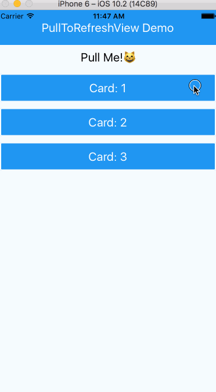
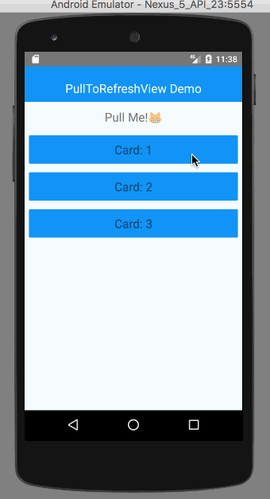

# react-native-pull-to-refresh (iOS/Android)
> The pull-to-refresh view component for React Native

[]()[]()


[](https://nodei.co/npm/react-native-pull-to-refresh/)

[](https://github.com/feross/standard) [](http://forthebadge.com)

Demo
---
iOS|Android
----|----
| 

# Installation
```
npm i react-native-pull-to-refresh --save
```


# Getting started


```jsx
import PTRView from 'react-native-pull-to-refresh';


var PullToRefreshProject = React.createClass({
  _refresh: function() {
    return new Promise((resolve) => {
      setTimeout(()=>{resolve()}, 2000)
    });
  },
  render: function() {
    return (
      <PTRView onRefresh={this._refresh} >
        <View style={styles.container}>
          <Text style={styles.welcome}>
            Let's Pull!
          </Text>
        </View>
      </PTRView>
    );
  },
});
```
# Props

## onRefresh
The method of refresh. You have to return promise object.

## delay(default:`0`)
delay time of refresh. If you set this this prop, refresh function will be delayed

## offset(default:`80`) `iOS`
distance of pull to refresh

## colors(default:`#000`) `Android`
The background color of the refresh indicator

## progressBackgroundColor(default:`transparent`) `Android`
The background color of the refresh indicator

# Contributing
Welcome :)

You can use following command in `example` dir:

```
npm run sync
```

During running this command, when you change source to implement/fix something, these changes will sync to `example/node_modules/react-native-pull-to-refresh/`. You can check your change using example project easily.

# License
MIT
